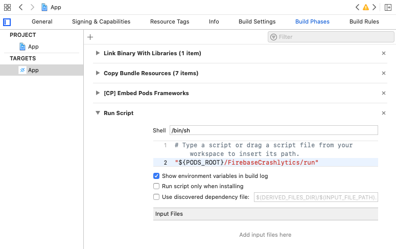

# This development is finished. We reccomend https://github.com/capacitor-community/firebase-crashlytics

[](https://badge.fury.io/js/%40rdlabo%2Fcapacitor-firebase-crashlytics)

# capacitor-firebase-crashlytics
This is Firebase Crashlytics plugin for Capacitor.

## Demo
[Demo code is here.](https://github.com/rdlabo-team/capacitor-firebase-crashlytics/tree/master/demo/angular)

## DONATE THIS PROJECT
Thanks for considering donate.

If this plugin help you, please share your app income. This help developing this plugin.This also help me easily determine how much time I would spend on the projects each month.

|  | TYPE | AMOUNT | LINK |
|:--:|:--:|:--:|:--:|
| PayPal.me | Once | Any | [Donate](https://www.paypal.me/rdlabo) |
| PayPal | Subscription | $15/month | [Donate](https://www.paypal.com/cgi-bin/webscr?cmd=_s-xclick&hosted_button_id=JHYSDYQB29MLC) |
| PayPal | Subscription | $30/month | [Donate](https://www.paypal.com/cgi-bin/webscr?cmd=_s-xclick&hosted_button_id=RCJ8A3KXG928A) |
| PayPal | Subscription | $50/month | [Donate](https://www.paypal.com/cgi-bin/webscr?cmd=_s-xclick&hosted_button_id=U2RQUKRPDA35C) |

## Installation
```bash
$ npm install @rdlabo/capacitor-firebase-crashlytics
```

## Android configuration
Download the `google-services.json` file and copy it to the `android/app/` directory of your capacitor project. You will also need to add the Firebase SDK to your gradle files. 

More info can be found here: 

https://firebase.google.com/docs/android/setup#manually_add_firebase

In file `android/app/src/main/java/**/**/MainActivity.java`, add the plugin to the initialization list:
    
```diff
  this.init(savedInstanceState, new ArrayList<Class<? extends Plugin>>() {{
    [...]
+   add(jp.rdlabo.capacitor.plugin.firebase.crashlytics.FirebaseCrashlyticsPlugin.class);
    [...]
  }});
```

### set gradle
Set setting using Firebase Crashlytics:
https://firebase.google.com/docs/crashlytics/get-started?authuser=0&platform=android


> build.gradele(Project: android)
```
  buildscript {
   
      repositories {
          google()
          jcenter()
      }
      dependencies {
          classpath 'com.android.tools.build:gradle:3.6.1'
          classpath 'com.google.gms:google-services:4.3.3'
          // NOTE: Do not place your application dependencies here; they belong
          // in the individual module build.gradle files
+         classpath 'com.google.firebase:firebase-crashlytics-gradle:2.1.0'
      }
  }
```

> build.gradle(Module:app)
```
  apply plugin: 'com.android.application'
+ apply plugin: 'com.google.firebase.crashlytics'
  android {
      compileSdkVersion rootProject.ext.compileSdkVersion
      defaultConfig {
...
```

## iOS configuration
Download the `GoogleService-Info.plist` file. In Xcode right-click on the yellow folder named, "App" and select the 'Add files to "App"'. 

*tip: If you drag and drop your file to this location, You need set `Target Membership` on Xcode.*

### set scripts
Set script using Firebase Crashlytics:
https://firebase.google.com/docs/crashlytics/get-started?authuser=0&platform=ios

1. Open your project in Xcode, then select its project file in the left navigator.
2. From the Select a project or target dropdown, select your main build target.
3. Select the Build Phases tab, then click add > New Run Script Phase.
4. Expand the new Run Script section that appears. In the script field (located under the Shell field), add a new run script:

```
"${PODS_ROOT}/FirebaseCrashlytics/run"
```



## Methods
### setCustomValue(options: { key: string; value: string | number })

```js
Plugins.FirebaseCrashlyticsPlugin.setCustomValue({ key: 'keyName', value: 'valueName' });
```

### setUserID(options: { id: string })

```js
Plugins.FirebaseCrashlyticsPlugin.setUserId({ id: '12345' });
```
